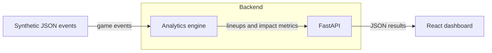

# Architecture

HoopVision starts as a small local app.

The goal is to keep the system simple at first, then only add more complicated pieces when there is a real reason.

## Version 0

The first version has four main parts:

1. Synthetic game data
2. Analytics logic
3. API
4. Web dashboard

## Data Flow

Arrows indicate result data flow.

## Future Phases

Later versions may add:

- Video ingestion
- Async jobs
- Queues
- Streaming updates
